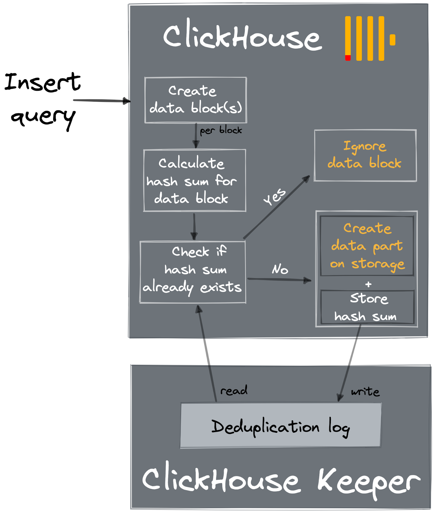
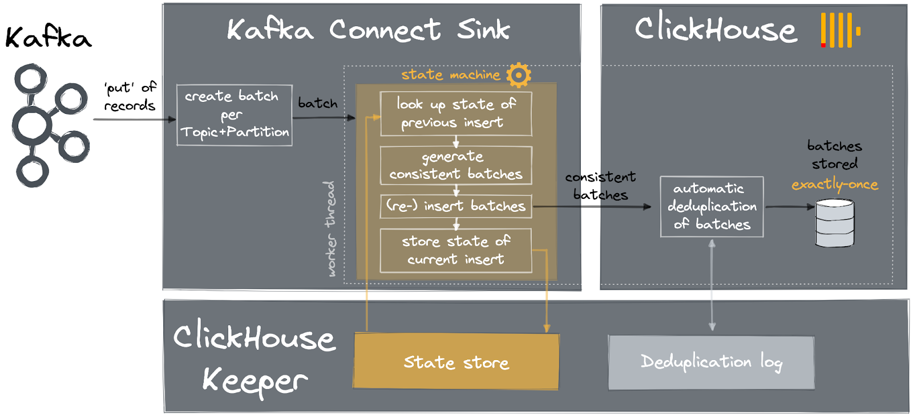
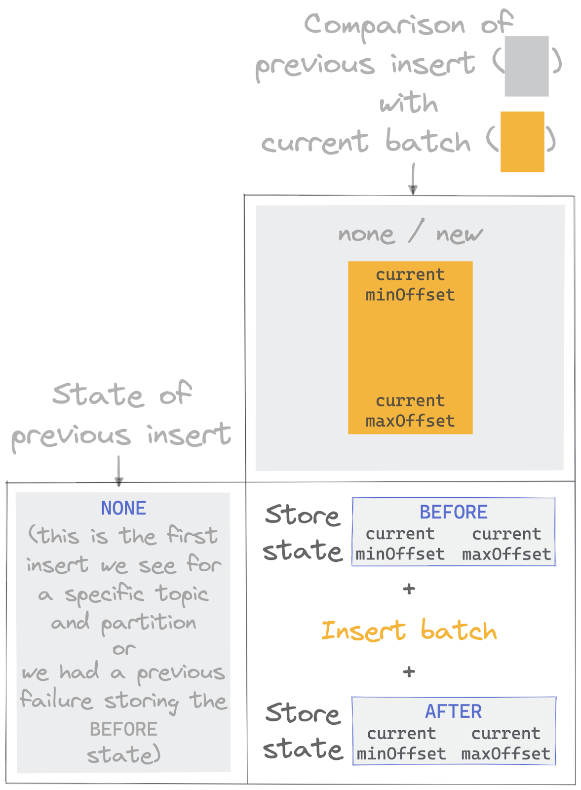
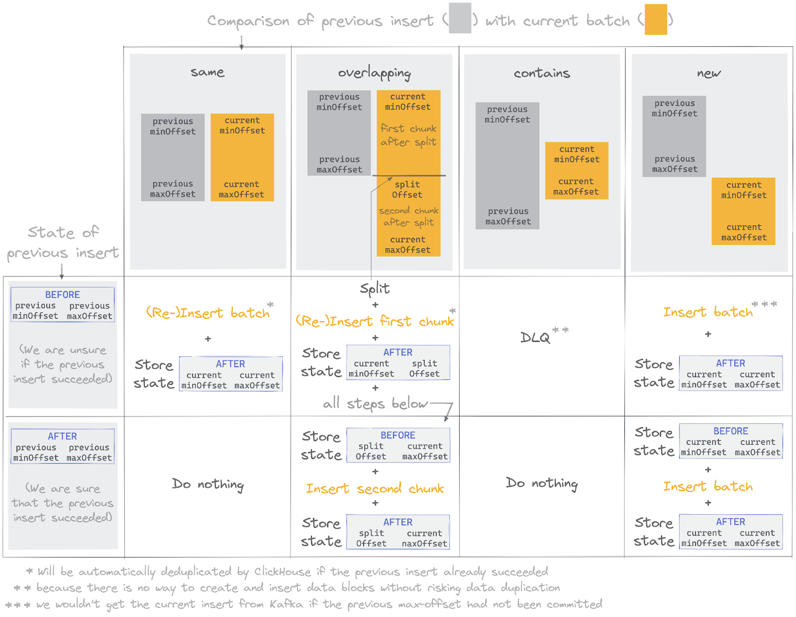
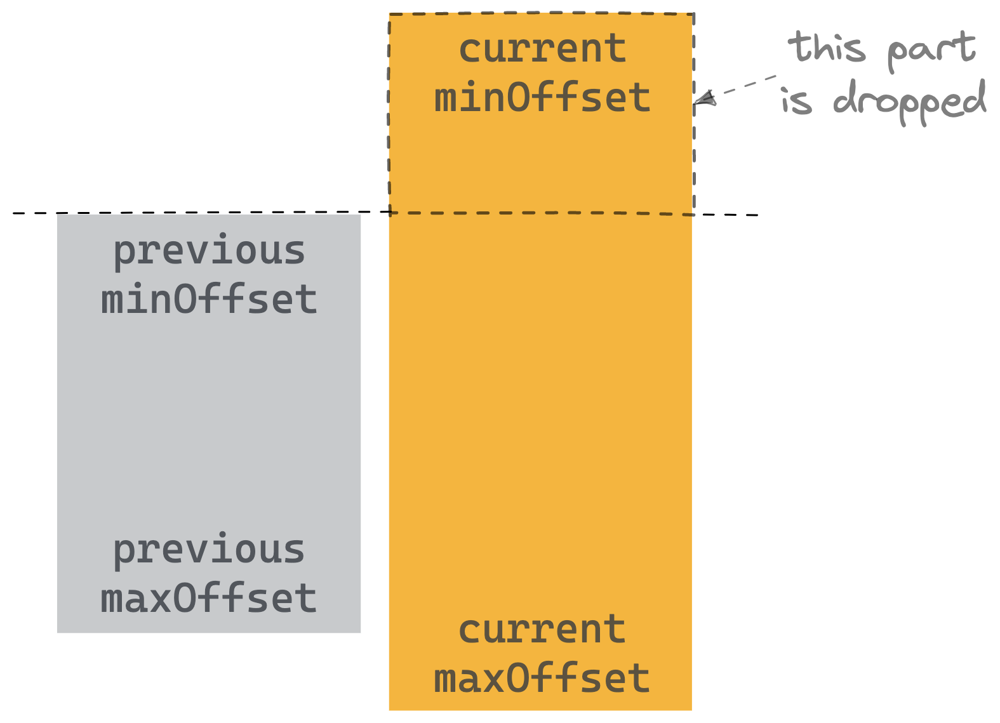
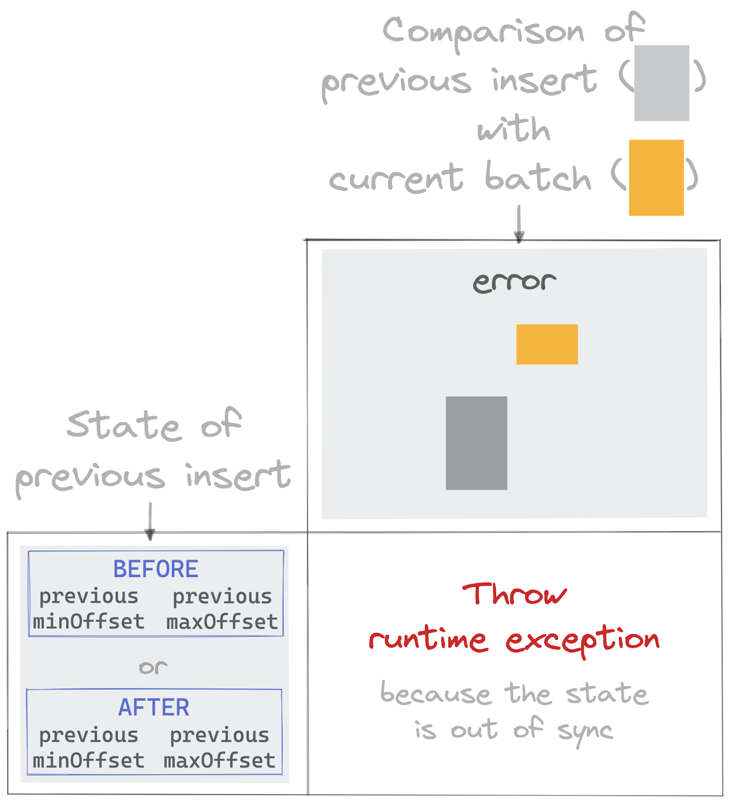

# Introduction

This document details the current design and implementation for ClickHouse-kafka-connect and how it aims to achieve exactly-once delivery semantics.

# Requirements

For the reasons behind the development of this connector, see [here](https://clickhouse.com/blog/kafka-connect-connector-clickhouse-with-exactly-once).

The connector aims to be:

* **Independent of ClickHouse** - The connector should run independently of ClickHouse as an architecturally independent component.
* **Push-based** - Data should be pushed to ClickHouse from Kafka. ClickHouse should have no awareness or need to connect to Kafka. This connector should thus work in environments where ClickHouse is cloud-hosted, and Kafka is self-managed.
* **Support for all ClickHouse types** - including complex types, e.g., Map. Note currently this effort is underway with support for the Tuple and JSON types pending.
* **Exactly-once delivery** - every Kafka message will always be delivered only one time to ClickHouse. A message cannot be dropped or duplicated.

The Kafka Connect framework addresses the first two of these requirements. Support for all ClickHouse types largely relies on using the official [ClickHouse-supported Java client.](https://github.com/ClickHouse/clickhouse-jdbc) This issue focuses on how we propose achieving exactly-once delivery semantics.

## Addressing exactly-once

### Known Challenges

Of our requirements, implementing exactly-once delivery semantics presented the biggest challenge. Before we address how we achieve this, let's remind ourselves how at-least-once semantics can sometimes result in duplicates. These reasons are often connector specific but generally fall into two patterns, both related to how messages are consumed from Kafka and the means of tracking the current position (offset) on the queue of messages:

* A [consumer](https://docs.confluent.io/platform/current/clients/consumer.html) processes a Kafka message, sending it to ClickHouse and committing the offset before crashing and losing it's in memory offset. Kafka, in this case, has been configured to [auto-commit offsets](https://docs.confluent.io/platform/current/clients/consumer.html#id1) (the default) but has not had a chance to perform the commit the offset it received from the consumer ([this is periodic](https://docs.confluent.io/platform/current/clients/consumer.html#id1)). The consumer restarts, and as a result, it is delivered messages from the last committed offset it has already consumed.
* The consumer uses the commit API (auto-commit is disabled) and takes responsibility for committing offsets in Kafka. It processes a Kafka message, sending it to ClickHouse, but crashes before committing its offset to Kafka. Once restarted, Kafka delivers messages from the last offset, causing duplicates to be sent to ClickHouse.

Note that these cases assume offsets are tracked within Kafka. The exact causes often depend on the integration, [offset commit policy](https://docs.confluent.io/platform/current/clients/consumer.html#offset-management), and [API used](https://kafka.apache.org/31/javadoc/org/apache/kafka/clients/consumer/KafkaConsumer.html). Further reading [here](https://docs.confluent.io/platform/current/clients/consumer.html).

A [common solution to the problem](https://docs.confluent.io/platform/current/clients/consumer.html#offset-management) is to manage your offsets in your target data store. This can involve a number of approaches, often depending on the properties of the target data store. For example, the connector can commit the offsets with the messages if the datastore offers ACID transactions.  A two-phased commit, using a different store for the offsets, might be viable if not. Typically, these approaches incur an overhead and reduce throughput.

### High-level approach

When considering a solution, we want something that involves minimal dependencies, is architecturally simple, and exploits existing properties of ClickHouse (and ideally didn’t need changes to its eventual consistency replication model).

We dismissed solutions using a two-phase commit or storing offsets in ClickHouse, as architecturally too complex and likely not performant. Strategies, such as offering only at-least-one delivery semantics in the connector but enforcing a [Collapsing](https://clickhouse.com/docs/en/engines/table-engines/mergetree-family/collapsingmergetree)/[ReplacingMergeTree](https://clickhouse.com/docs/en/engines/table-engines/mergetree-family/replacingmergetree/) for data storage, were too restrive and offer[ deduplication through only eventual consistency](https://learn.clickhouse.com/visitor_catalog_class/show/1050521/Deduplication) (without an expensive FINAL modifier on all queries).

The current solution exploits a property of ClickHouse, which can initially cause some [getting-started confusion](https://clickhouse.com/blog/common-getting-started-issues-with-clickhouse). If identical inserts are made to ClickHouse within a certain time period, they are de-duplicated. This is known as the [replicated_deduplication_window](https://clickhouse.com/docs/en/operations/settings/merge-tree-settings/#replicated-deduplication-window) and is enabled by default on replicated instances. When data is inserted into ClickHouse, it creates one or more blocks (parts). In replicated environments, such as ClickHouse Cloud, a hash is written in ClickHouse Keeper. Subsequent inserted blocks are compared against these hashes and ignored if a match is present. This is useful since it allows clients to safely retry inserts in case of no acknowledgment from ClickHouse, e.g., because of a network interruption. This requires blocks to be identical, i.e., the same size with the same rows in the same order. These hashes are stored for only the most recent 100 blocks, although this [can be modified](https://clickhouse.com/docs/en/operations/settings/merge-tree-settings/#replicated-deduplication-window). Note higher values will slow down inserts due to the need for more comparisons.

This same behavior can be enabled for non-replicated instances via the setting [non_replicated_deduplication_window](https://clickhouse.com/docs/en/operations/settings/merge-tree-settings/#replicated-deduplication-window). In this case, the hashes are stored on a local disk.

This property can be combined with the knowledge that if ClickHouse acknowledges a write, the insert has been successful. With both of these behaviors, the challenge becomes ensuring:

1. We have a guarantee that in the event of failure, duplicate data is received on recovery. 
2. Identical batches are always formulated on retries in the event of failure. 

If we could ensure these properties hold true, we could exploit ClickHouse’s ability to handle duplicate inserts.  At this point, we need to select the appropriate Kafka API. While low-level [consumer APIs ](https://kafka.apache.org/33/javadoc/index.html?org/apache/kafka/clients/consumer/KafkaConsumer.html)offer “[Manual Offset Control](https://kafka.apache.org/33/javadoc/index.html?org/apache/kafka/clients/consumer/KafkaConsumer.html)”, the [SinkTask API](https://docs.confluent.io/5.0.4/connect/javadocs/org/apache/kafka/connect/sink/SinkTaskContext.html) offers a higher-level integration point sufficient for our needs. This API delivers provides at-least-once delivery and requires implementors to implement a `put` method to which records are passed in batches. The Kafka Connect framework transparently tracks offset positions, periodically committing them. We are provided with a guarantee here - the committed position will not exceed the offset of the last completed `put` call. Provided our implementation of `put` ensures a write to ClickHouse is completed with the batch, we should achieve at-least-once delivery. This leaves us with only needing to formulate identical batches.

To ensure we always formulate identical batches to ClickHouse, we need to maintain a state of our current processing and a record of the previous insert. We can use this information to slice and merge batches to ensure the consistency of inserts. We do this using a state machine per topic and partition to align with how processing can be distributed in Kafka and how offsets are tracked. Specifically, for each `put` of records, we generate a batch per topic and partition, look up the previous state for this topic/partition and generate consistent inserts to ClickHouse based on a set of rules implemented as a state machine. This can be summarized as shown below:

Not that the above process is single-threaded per worker, i.e., only a single thread can operate on any single topic/partition simultaneously.

### Storing State

[ClickHouse Keeper](https://clickhouse.com/docs/en/operations/clickhouse-keeper/) provides strongly consistent storage for data associated with ClickHouse's cluster coordination system and is fundamental to allowing ClickHouse to function as a distributed system. This supports services such as [data replication](https://clickhouse.com/docs/en/engines/table-engines/mergetree-family/replication), [distributed DDL](https://clickhouse.com/docs/en/sql-reference/distributed-ddl) query execution, leadership elections, and service discovery. ClickHouse Keeper is compatible with ZooKeeper, the legacy component used for this functionality in ClickHouse. Like Zookeeper, ClickHouse Keeper supports [linearizability for writes](https://en.wikipedia.org/wiki/Linearizability) and [sequential consistency](https://en.wikipedia.org/wiki/Sequential_consistency) for reads. However, it has distinct advantages over Zookeeper, mainly compressed logs, lightweight installation, a smaller memory consumption (no JVM), and even optionally linearizability of reads by implementing the RAFT algorithm in C++. These properties are ideal for persisting small data quantities when highly consistent storage is required.

Our proposed connector design requires the connector to store state in a strongly consistent store with sequential consistency and linearizable writes. Initially, we considered ClickHouse but discounted this quickly for several reasons. Firstly, ClickHouse is not strongly consistent by default and offers only eventual consistent replication. With careful configuration, however, you can ensure [linearizable inserts](https://clickhouse.com/docs/en/operations/settings/settings/#settings-insert_quorum) and [sequential consistency for SELECTS](https://clickhouse.com/docs/en/operations/settings/settings/#settings-select_sequential_consistency) for a [replicated table](https://clickhouse.com/docs/en/engines/table-engines/mergetree-family/replication#table_engines-replication). However, this ClickHouse configuration adds significant insertion latency, principally because of the increased communication with ClickHouse Keeper to coordinate the write and subsequent data replication. This design effectively adds a redundant component and unnecessary overhead - the ClickHouse table storage. Given we only need to store minimal state, using ClickHouse Keeper directly seemed the perfect solution to address these requirements.

The challenge with this approach is that this component is typically not exposed in a cluster. For example, it's not exposed in ClickHouse Cloud, and its access and use should be carefully controlled not to impact cluster operations and stability. Working with the ClickHouse core team, we decided to expose ClickHouse keeper (for cases where linearizable inserts and sequential consistency are required) in a controlled way through a table engine - the [KeeperMap engine](https://github.com/ClickHouse/ClickHouse/pull/39976). This provides us with an integrated and lightweight means of storing our state. 

Note that you can test the connector without KeeperMap using an in-memory mode. This is for testing only and makes no exactly-once guarantees in the event of failure.

### State Machine

For each topic/partition batch, we record the following information:

1. The current minimum and maximum offset - `minOffset` and `maxOffset`, of the batch.
2. Prior to inserting the data into ClickHouse, a flag `BEFORE` is set. If and only if the insert is successful, a flag `AFTER` is set.

When handling a batch for a specific topic and partition, we look up this information for the previous insert. If the latest state is `AFTER,` we know the previous insert was successful. Conversely, `BEFORE` means the connector could not confirm whether ClickHouse received and acknowledged the data. The absence of either state means either this is the first time we have seen data for this topic or partition, or we weren't able to set even set a `BEFORE` state. These are logically identical. This is the simplest case in our state machine:

As shown, the state is set to `BEFORE` before the insert to ClickHouse is performed. If successful and acknowledged, the state is set to `AFTER`. Any of these steps could fail.

For subsequent inserts, we should have a previous state for each topic/partition. When comparing the previous state to a new batch, we have 4 possible outcomes with 2 choices depending on whether a `BEFORE` or `AFTER` flag is set:

1. **Same** - The min and max offset of the previous batch is identical. If the state is `BEFORE`, we can't be sure our previous insert was successful, so the batch is reinserted and possibly deduplicated in ClickHouse. If the previous state was AFTER, we drop this data as it has already been sent.
2. **Overlapping** - The min offset of the new batch is the same as the previous, but the max is greater. In this case, we split the new batch into two chunks, where the first of these is identical to the previous batch. Both of these chunks are reinserted if the previous state is `BEFORE`. If the previous state is `AFTER`, only the 2nd chunk is inserted.
3. **Contains** - The min and max offset of the new batch are contained by the previous values, i.e., the new min offset > previous min offset and new max offset &lt; previous max offset. In this case, we can safely do nothing if the previous state was `AFTER`. However, if the previous state was `BEFORE`, we cannot create and insert blocks without possible duplication. The data, in this case, is written to a Dead Letter Queue (DLQ). We expect this to be a rare event.
4. **New** - The most common case. In this case, the min offset of the new block is greater than the max offset of the previous, i.e., we have new data. In this case, the data can be inserted.

This is summarized below:

There is one case not covered by the above. We may simply get data for a partition and batch whose `minOffset` is less than the `minOffset` of the previous state. This is shown below:

In this case, we know a portion of the data, up to the previous minOffset of the new batch, has already been processed. We always drop this, as shown above, and continue with the above state machine rules with the “reduced” batch.

Finally, other cases are still possible. For example, suppose the maxOffset of our new batch is less than the minOffset of the previous. These cases are irrecoverable and likely due to external manipulation of the Kafka offsets, resulting in an exception.

### Scaling

Our implementation of the `put` method for the SinkTask is single-threaded. By grouping records by topic and partition, before invoking the state machine, we ensure we track offsets in the same way as Kafka, i.e., by topic/partition. This allows us to easily exploit [the worker model](https://docs.confluent.io/platform/current/connect/concepts.html#distributed-workers) of the Kafka Connect framework. For each topic, a worker is assigned a set of partitions. This scales up to the number of workers equal to the number of partitions. Our use of ClickHouse keeper for our state store means work can easily be rebalanced and use this central record of our current position with strong consistency guarantees.

### Sharding

Our sharding implementation deterministically distributes messages given a set of endpoints under a single or a set of topics. These endpoints can be different shards of a database or different databases entirely. We rely on clickhouse to internally replicate to its replicas of shards. The distribution happends based on the hashes of the message and split to different endpoints assuming hashes are uniformely distributed in its hashspace. We can then supply the same hash function and endpoints to distributed table engine for querying. Each connection is done as a task, which means `max.tasks` needs to be greater or equal to the number of endpoints. We also added `endpoints` as a key in the connector config file to specify different endpoints. We assume the same username and passwords can access different shards or it will not be supported by distributed engine for querying.

We allow specifying the hash function name for sharding. We introduce the config key `hashFunctionName` as an optional config keyword. This can be paired with hash function name used in distributed table engine when qurying from different shards.